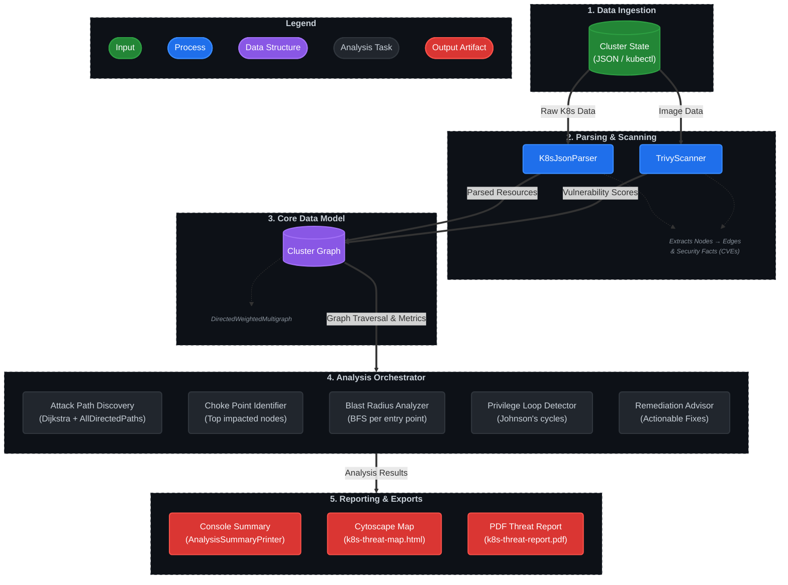
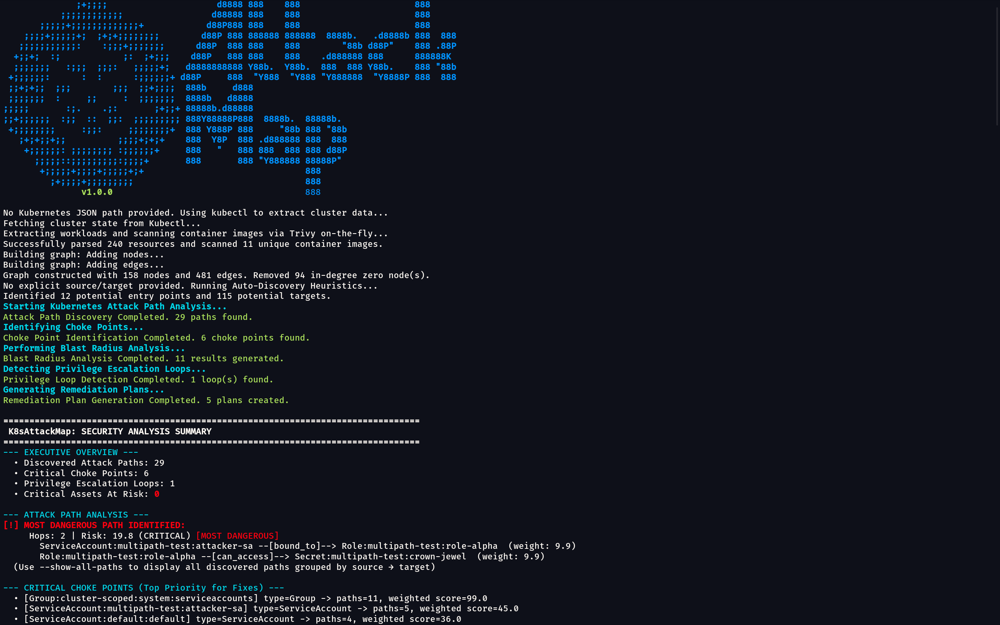
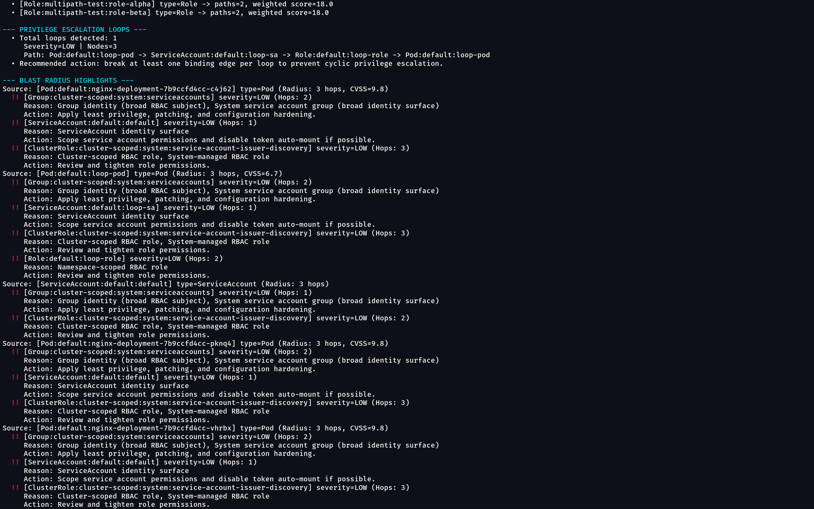
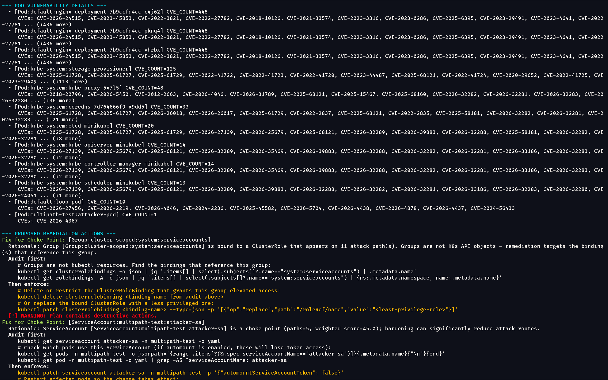
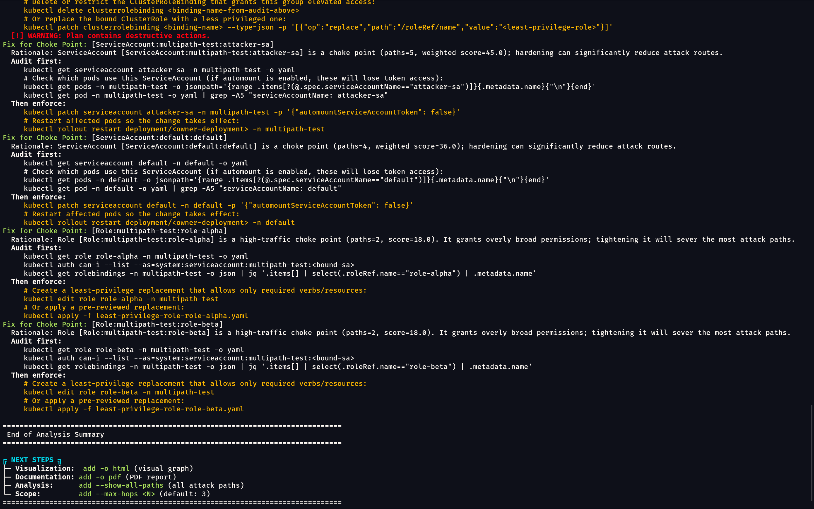
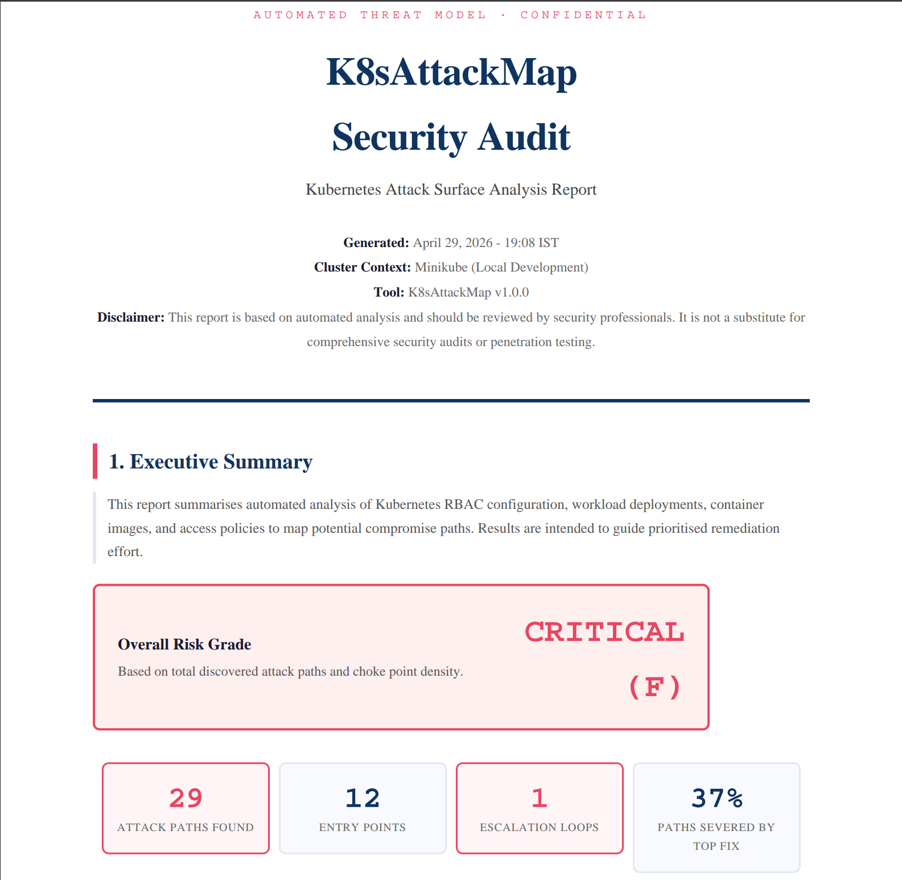

<div align="center">
  <a href="#quick-start">
    
  </a>

  <br/>

[](https://opensource.org/licenses/Apache-2.0)
[](https://openjdk.org/)
[](https://www.graalvm.org/)
[](https://trivy.dev/)
[](https://github.com/SaptarshiSarkar12/K8sAttackMap/issues)

**Kubernetes attack surface visualiser and security advisor.**  
Ingests a live or offline cluster snapshot, builds a directed attack graph across RBAC, workloads, secrets, and node
relationships, then surfaces the most dangerous paths, choke points, and remediation steps — all in a single command.

</div>

---

## Table of Contents

- [Why K8sAttackMap?](#why-k8sattackmap)
- [How It Works](#how-it-works)
- [Key Features](#key-features)
- [Prerequisites](#prerequisites)
- [Installation](#installation)
    - [Native Binary (recommended)](#native-binary-recommended)
    - [Build from Source](#build-from-source)
- [Quick Start](#quick-start)
- [Usage](#usage)
    - [CLI Reference](#cli-reference)
    - [Examples](#examples)
- [Output Formats](#output-formats)
- [Architecture](#architecture)
- [Contributing](#contributing)
- [License](#license)

---

## Why K8sAttackMap?

Most Kubernetes security tools check policy compliance in isolation — they tell you a pod is privileged or a role has
wildcard verbs, but they don't tell you *what an attacker can actually reach* from that misconfiguration. K8sAttackMap
connects those dots.

Given a cluster snapshot, the tool:

1. Parses every workload, RBAC binding, secret, and service account relationship.
2. Scans container images for known CVEs using [Trivy](https://trivy.dev/).
3. Builds a weighted directed multigraph where edges represent real attack capabilities (`uses_sa`, `bound_to`,
   `can_access`, `mounts_secret`, `node_escape`, and more).
4. Runs `Dijkstra` and `AllDirectedPaths` to find the shortest and all possible compromise routes.
5. Identifies choke points — the single nodes whose hardening eliminates the most attack paths.
6. Detects privilege escalation loops (circular RBAC chains).
7. Outputs prioritised, actionable `kubectl` remediation commands.

---

## How It Works



Edge weights are computed by `EdgeRiskScorer` from per-node CVE scores, security context flags, and RBAC sensitivity. A
lower weight means an easier traversal for an attacker — Dijkstra finds the path of least resistance.

---

## Key Features

| Feature                         | Details                                                                                                                   |
|---------------------------------|---------------------------------------------------------------------------------------------------------------------------|
| **Attack path discovery**       | Shortest paths (Dijkstra) and all simple paths up to depth `max(baseLen + 2, 8, 10)` per source→target pair               |
| **Choke point ranking**         | Nodes ranked by number of paths severed if hardened; top-5 displayed with weighted scores                                 |
| **Blast radius analysis**       | BFS from each compromised entry point up to configurable hop depth                                                        |
| **Privilege escalation loops**  | Johnson's simple cycle algorithm on a simplified graph; RBAC-only filter removes infrastructure ownership false positives |
| **CVE-aware scoring**           | Trivy scan results integrated into edge weights and node risk scores; results cached across runs                          |
| **Mounted secret detection**    | Edges created for `spec.volumes[].secret`, `envFrom.secretRef`, and `env[].valueFrom.secretKeyRef`                        |
| **Workload ownership chains**   | `Deployment → ReplicaSet → Pod` via `ownerReferences`; `Managed` edges modelled                                           |
| **Group expansion**             | `system:serviceaccounts` and `system:serviceaccounts:<ns>` groups expanded to individual SA nodes                         |
| **ClusterRole cross-namespace** | ClusterRole `can_access` edges correctly cover all namespaces, not just `cluster-scoped`                                  |
| **Native binary**               | Built with GraalVM Native Image; no JVM required at runtime                                                               |
| **HTML visualisation**          | Interactive Cytoscape.js graph with blast radius highlighting, entry/choke point colouring                                |
| **PDF report**                  | Structured audit report with executive summary, choke point table, attack path hops, remediation cards, CVE summary       |

---

## Prerequisites

| Tool                                                                 | Version  | Purpose                                                                 |
|----------------------------------------------------------------------|----------|-------------------------------------------------------------------------|
| [Trivy](https://trivy.dev/docs/latest/getting-started/installation/) | ≥ 0.70.0 | Container image CVE scanning                                            |
| `kubectl`                                                            | any      | Live cluster extraction (optional — JSON file can be provided directly) |

To capture a live cluster snapshot:

```bash
kubectl get pods,services,serviceaccounts,roles,clusterroles,rolebindings,clusterrolebindings,secrets,configmaps,deployments,replicasets,daemonsets,statefulsets,nodes -A -o json > cluster-state.json
```

> Trivy must be on `PATH`. K8sAttackMap calls `trivy image --format json` for each unique container image it encounters.

---

## Installation

### Native Binary (recommended)

Download the latest pre-built binary for your platform from
the [Releases](https://github.com/SaptarshiSarkar12/K8sAttackMap/releases) page.

```bash
# Linux / macOS
chmod +x k8sattackmap
./k8sattackmap --help

# Windows
k8sattackmap.exe --help
```

### Build from Source

**Requirements:** [GraalVM](https://www.graalvm.org/downloads/) 25, JDK 25, Maven 3.9+

```bash
git clone https://github.com/SaptarshiSarkar12/K8sAttackMap.git
cd K8sAttackMap

# Set GRAALVM_HOME to your local GraalVM installation path
export GRAALVM_HOME=/path/to/graalvm
# Add GraalVM's bin to PATH and lib to LD_LIBRARY_PATH for native-image
export PATH=$GRAALVM_HOME/bin:$PATH
export LD_LIBRARY_PATH=$GRAALVM_HOME/lib:$LD_LIBRARY_PATH

# GraalVM Native Image build
mvn clean package
```

The native binary is written to `target/K8sAttackMap`. You can move it to a directory on your `PATH` for easier access.

---

## Quick Start

Run the tool against a live cluster or a saved JSON snapshot. By default, it auto-discovers entry points and targets,
finds the most dangerous path, identifies choke points, and prints a console summary.

> **Prerequisites:** Ensure `trivy` is on your `PATH` and you have `kubectl` access (for live cluster mode) or a saved cluster snapshot.

### Run against live cluster

```bash
# Requires kubectl access to your cluster
./k8sattackmap
```

### Run against saved cluster snapshot

```bash
# First, capture your cluster state
kubectl get pods,services,serviceaccounts,roles,clusterroles,rolebindings,clusterrolebindings,secrets,configmaps,deployments,replicasets,daemonsets,statefulsets,nodes -A -o json > cluster-state.json

# Then run analysis
./k8sattackmap -k cluster-state.json
```

### Example use cases

```bash
# 1. Show all paths between specific source and target nodes
./k8sattackmap -k cluster-state.json \
    -s Pod:default:compromised-app \
    -t Secret:production:db-password \
    --show-all-paths

# 2. Deep blast radius analysis (5-hop radius) with PDF report
./k8sattackmap -k cluster-state.json -m 5 -o pdf

# 3. Multiple sources and targets, both HTML and PDF outputs
./k8sattackmap -k cluster-state.json \
  -s "Pod:default:api-server,ServiceAccount:default:ci-runner" \
  -t "Secret:default:jwt-key,Secret:prod:stripe-key" \
  -o html,pdf
```

> [!NOTE]
> The source and target node ID format is `<Type>:<namespace>:<name>`.
> For cluster-scoped resources, use `cluster-scoped` as the namespace. Example:
`ClusterRole:cluster-scoped:cluster-admin`.

**Output**: HTML visualisation can be opened in your browser; PDF report is written to the current directory.
Both are suitable for sharing with security teams.

---

## Usage

### CLI Reference

```
K8sAttackMap [OPTIONS]

Options:
  -h, --help                   Print this message
  -v, --version                Print version
  -k, --k8s-json <PATH>        Path to Kubernetes cluster state JSON file
  -s, --source-node <IDS>      Comma-separated source node IDs
                               Format: <Type>:<namespace>:<name>
                               Example: Pod:default:web-app
  -t, --target-node <IDS>      Comma-separated target node IDs
                               Format: <Type>:<namespace>:<name>
                               Example: Secret:default:db-credentials
  -o, --output <FORMATS>       Comma-separated output formats: html, pdf
  -m, --max-hops <N>           Blast radius hop depth (default: 3)
  -a, --show-all-paths         Show all discovered paths grouped by
                               source→target pair, not just the worst path
      --verbose                Enable verbose/debug logging
```

When `--source-node` and `--target-node` are omitted, the tool runs auto-discovery heuristics: pods, users, and service
accounts become sources; secrets, roles, ClusterRoles, and sensitive ConfigMaps become targets.

### Examples

```bash
# Offline analysis from a saved cluster snapshot
./k8sattackmap -k cluster-state.json

# Explicit source and target (useful for red-team validation)
./k8sattackmap -k cluster-state.json \
  -s Pod:default:compromised-app \
  -t Secret:production:db-password

# All paths, verbose logging, both outputs
./k8sattackmap -k cluster-state.json --show-all-paths --verbose -o html,pdf

# Multiple sources and targets
./k8sattackmap -k cluster-state.json \
  -s "Pod:default:api-server,ServiceAccount:default:ci-runner" \
  -t "Secret:default:jwt-key,Secret:prod:stripe-key"
```

---

## Output Formats

### Console (always on)

<table>
  <tr>
    <td></td>
    <td></td>
  </tr>
  <tr>
    <td></td>
    <td></td>
  </tr>
</table>

### HTML (`-o html`) → `k8s-threat-map.html`

Interactive [Cytoscape.js](https://js.cytoscape.org/) graph displaying the attack surface with colour-coded nodes: entry
points bordered in green hexagon, choke points in gray, nodes within blast radius in yellow, and attack paths
highlighted in red. Edges are labelled with their relationship type and weighted by risk score.

<table>
  <tr>
    <td></td>
    <td></td>
  </tr>
</table>

### PDF (`-o pdf`) → `k8s-threat-report.pdf`

A structured security audit report containing:

- Executive summary with risk grade and key metrics
- Top-5 choke points with impact percentages
- Critical attack path hop-by-hop table
- Per-choke-point remediation plans with audit and enforcement commands
- Privilege escalation loop table
- Pod CVE summary sorted by count



---

## Architecture

```
src/main/java/io/github/SaptarshiSarkar12/k8sattackmap/
│
├── K8sAttackMapApplication.java   # Entry point, wiring
│
├── cli/                           # Argument parsing (Apache Commons CLI)
│   └── CommandParser.java
│
├── ingestion/                     # Cluster data parsing
│   ├── K8sJsonParser.java         # JSON → nodes, edges, SecurityFacts
│   └── KubectlExtractor.java      # Live kubectl capture
│
├── model/                         # Core domain types
│   ├── GraphNode.java             # Vertex with type, namespace, risk score
│   ├── GraphEdge.java             # Edge with EdgeType relationship
│   ├── EdgeType.java              # Enum: USES_SA, BOUND_TO, CAN_ACCESS, …
│   ├── SecurityFacts.java         # RBAC flags, container posture, credential material
│   ├── ClusterGraphFactory.java   # Builds DirectedWeightedMultigraph
│   └── ClusterGraphData.java      # Parser output container
│
├── security/                      # Scanning and scoring
│   ├── AttackSurfaceClassifier.java  # Auto-discovers entry points and targets
│   ├── EdgeRiskScorer.java           # Computes edge weights from CVE/SecurityFacts
│   ├── TrivyScanner.java             # Invokes Trivy CLI
│   └── trivy/                        # Trivy JSON parsing and caching
│
├── analysis/                      # Core analysis algorithms
│   ├── AnalysisOrchestrator.java  # Coordinates all analysis stages
│   ├── AnalysisInput.java
│   ├── AnalysisResult.java
│   ├── graph/                     # Path finding
│   │   ├── AttackPathDiscovery.java   # Dijkstra + AllDirectedPaths
│   │   ├── Dijkstra.java
│   │   ├── PathDiscoveryResult.java
│   │   └── PrivilegeLoopDetector.java # Johnson's cycle detection
│   ├── chokepoint/                # Choke point ranking and remediation
│   │   ├── ChokePointIdentifier.java
│   │   ├── ChokePointRemediationAdvisor.java
│   │   ├── ChokePointResult.java
│   │   └── RankedChokePoint.java
│   ├── blast/                     # Blast radius BFS
│   │   ├── BlastRadiusAnalyzer.java
│   │   ├── BlastRadiusResult.java
│   │   ├── ImpactedAsset.java
│   │   └── ImpactSeverity.java
│   └── remediation/               # Remediation plan records
│       ├── RemediationPlan.java
│       └── ImpactRemediationAdvisor.java
│
├── export/                        # Output generation
│   ├── AnalysisSummaryPrinter.java  # Console output
│   ├── CytoscapeExporter.java       # HTML/JS visualisation
│   ├── PdfReportEngine.java         # PDF report
│   └── ExportService.java           # Coordinates export formats
│
└── util/                          # Shared utilities
    ├── AppConstants.java
    ├── RiskConfig.java            # Centralised risk thresholds
    ├── TemplateStore.java         # Runtime-loaded HTML/PDF templates
    ├── JacksonConfig.java         # Shared ObjectMapper
    ├── StringUtils.java
    ├── NodeFinder.java
    ├── WorkspaceManager.java
    └── ConsoleColors.java
```

---

## Contributing

See [CONTRIBUTING.md](CONTRIBUTING.md) for development setup, branching strategy, code style guidelines, and the pull
request process.

---

## License

[Apache License 2.0](LICENSE)